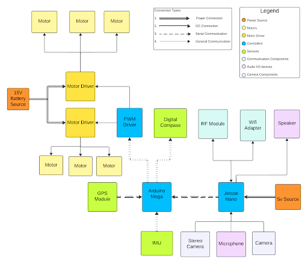

# Rover Genesis


**Genesis** is a semi-autonomous rover platform designed for outdoor exploration, GPS-guided waypoint navigation, and obstacle avoidance. The system operates using a hybrid architecture: high-level computer vision and decision-making are handled by an **Nvidia Jetson Nano**, while real-time motor control and sensor integration are managed by an **Arduino Mega**.

The platform features a custom Base Station for telemetry and control, as well as voice-command capabilities for hands-free operation.

## Table of Contents

1. [System Architecture](#system-architecture)
2. [Project Structure](#project-structure)
3. [Key Features](#key-features)
4. [Hardware Specifications](#hardware-specifications)
5. [Getting Started](#getting-started)
6. [Usage](#usage)
7. [Documentation](#documentation)
8. [Contributors](#contributors)

---

## System Architecture

The software is divided into two primary nodes communicating via radio telemetry:

1.  **Onboard System:** Runs on the rover. Handles autonomous navigation logic, depth-camera processing, and hardware actuation.
2.  **Base Station:** Runs on a host laptop. Provides a GUI for manual control, mode switching (Auto/Manual), and live status monitoring.



---

## Project Structure

This repository is organized as follows:

* **`base_station/`**: Ground control software.
    * `gui/`: Contains Tkinter interface logic and configuration.
    * `run_station.py`: Entry point for the laptop control application.
* **`onboard/`**: The primary rover software (Jetson Nano).
    * `controls/`: Algorithms for GPS navigation (`gps.py`) and autonomous logic (`fullauto.py`).
    * `handlers/`: Interfaces for Serial communication (`mega.py`) and Manual control mapping.
    * `modules/`: Drivers for the RealSense camera (`camera.py`).
    * `main.py`: Entry point for the rover.
* **`extra/`**: Experimental scripts and isolated tests.
    * `detection/`: Standalone scripts for testing obstacle avoidance algorithms.
    * `imu/`: Visualization tools for sensor data.
* **`pcb/`**: Hardware design files.
    * Contains schematics and Gerber files for the custom power distribution board.
* **`docs/`**: Detailed documentation and media assets.

---

## Key Features

* **GPS Guided Navigation:** autonomous traversal to waypoints using the Haversine formula and magnetometer heading correction.
* **Vision-Based Avoidance:** Uses an Intel RealSense D415 to detect obstacles. The pipeline utilizes Canny Edge Detection and depth thresholding to identify hazards.
* **Voice Interaction:** Supports voice commands (e.g., "Stop", "Go") and Q&A using NLP models.
* **Telemetry:** Long-range 433MHz radio link for status updates and manual override.
* **Custom Electronics:** Features a dedicated PCB for efficient power management between the computing units and high-torque motors.

---

## Hardware Specifications

* **Compute:** Nvidia Jetson Nano (4GB) & Arduino Mega 2560
* **Vision:** Intel RealSense D415 Depth Camera
* **Sensors:** Ublox Neo M8N GPS, HMC5883L Magnetometer
* **Actuation:** BTS7960 43A Motor Drivers
* **Communication:** 3DR 433MHz Telemetry Radio
* **Power:** 4S LiPo Battery (14.8V)

For a detailed breakdown of the electronics, refer to `docs/hardware.md`.

---

## Prerequisites

* **Hardware:** A fully assembled Genesis rover and a host laptop.
* **Operating System:** Ubuntu 18.04 (Jetson Nano), Linux/Windows/MacOS (Base Station).
* **Python:** Version 3.6 or higher.

---

## Usage

### 1. Launching the Base Station
On your control laptop, connect the telemetry radio and run:

```bash
cd base_station
python3 run_station.py
```

### 2. Launching the Rover
SSH into the Jetson Nano or connect via terminal. Ensure the Arduino is connected via USB. Run:

```bash
cd onboard
python3 main.py
```

### 3. Operation Modes
* **Manual:** Use the WASD keys on the Base Station to drive the rover.
* **Auto:** Upload GPS coordinates via the GUI. The rover will calculate the bearing and distance, navigating autonomously while avoiding obstacles.

---

## Documentation
For deep dives into the specific algorithms and hardware designs, please refer to the `docs/` folder:

* **[Software Manual](docs/software.md):** Detailed explanation of the navigation math (Haversine), logic flows, and Vision pipeline.
* **[Hardware Guide](docs/hardware.md):** Wiring diagrams and component specifics.
* **[PCB Schematics](pcb/schematic.pdf):** Circuit diagrams for the custom board.

---

## Contributors
* Aiden Ross D'souza
* Telukunta Phani Raj
* Koyaneni Yashwant
* Shubham Pandere
* Yuvraj Gupta