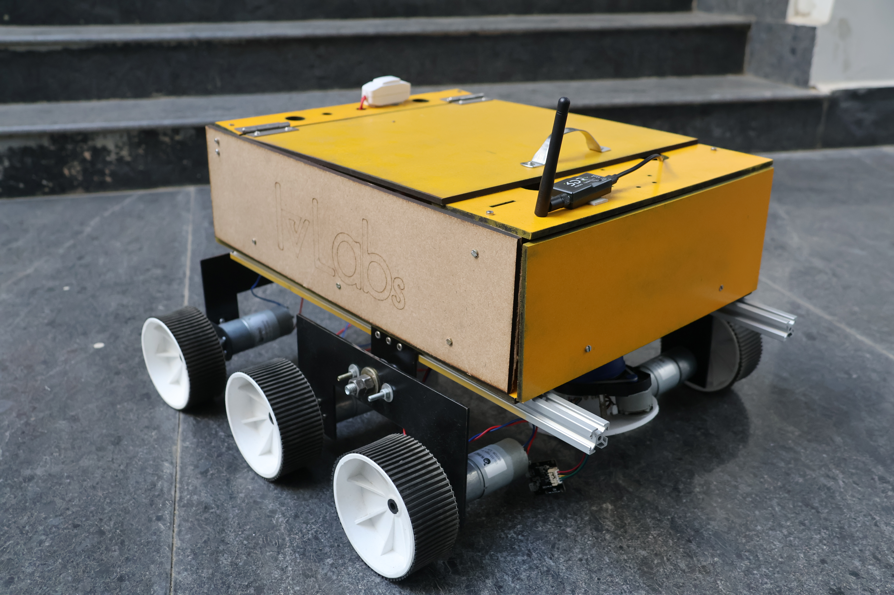
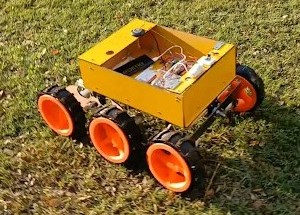

# Hardware & Electronics Specification

This document details the hardware architecture of the **Genesis** rover.

## Suspension System – Triple Bogie Configuration

The rover uses a **triple bogie suspension system** on each side, enabling high stability and smooth mobility over rough terrain. Each bogie can move independently, ensuring continuous wheel contact with uneven surfaces.

### Key Advantages

- **Terrain Adaptability:** Independent bogie movement keeps all wheels grounded, improving traction on rocks, slopes, and irregular surfaces.
- **Even Load Distribution:** Weight is shared across multiple wheels, reducing stress on individual components and increasing overall durability.
- **High Slope Stability:** The lowered center of mass and balanced weight distribution allow safe navigation on slopes up to **45°**.
- **Obstacle Handling:** The suspension can climb small obstacles and traverse gaps without wheel lift or instability.
- **Shock Absorption:** The interconnected bogies naturally dampen shocks, protecting onboard electronics and extending component lifespan.

## Wheel Design Comparison

Two wheel designs were evaluated: a **COTS (Commercial Off-The-Shelf) wheel** and an **in-house 3D-printed wheel**.

  
  

A summary of their performance is shown below:

### Table: Off-The-Shelf vs 3D-Printed Wheels

| Parameter         | COTS Wheel               | 3D-Printed Wheel               |
| ----------------- | ------------------------ | ------------------------------ |
| Diameter          | 10 cm                    | 22 cm                          |
| Width             | 4.4 cm                   | 6 cm                           |
| Rover Speed       | 20 cm/s                  | 44 cm/s                        |
| Grousers          | Small                    | Large                          |
| Grip              | Handles slopes up to 50° | Handles slopes up to 30°       |
| In-Place Rotation | Smooth                   | Wobbly (Due to large grousers) |

## Electronic Components

The table below shows a comprehensive list of all electronic components used.

| Component                                               | Purpose / Function                                                                        |
| ------------------------------------------------------- | ----------------------------------------------------------------------------------------- |
| 14.8 V 4-cell Lithium polymer battery                   | Supplies power to the motor drivers                                                       |
| 5V Power Bank                                           | Powers the Jetson Nano                                                                    |
| Power Distribution Board                                | Distributes electrical power from the main source to the motor drivers                    |
| Customised PCB                                          | Ensures stable connections between sensors and controllers                                |
| Jetson Nano (Student Developer Kit)                     | Primary processing unit for obstacle detection, voice commands, DetectNet, live streaming |
| Arduino Mega 2560                                       | Handles PWM signals, processes sensor data, communicates with peripherals                 |
| BTS7960 Motor Driver                                    | Controls the movement of six motors                                                       |
| Orange OG555 DC Motor                                   | Drives the rover’s wheels for movement and navigation                                     |
| Ublox Neo M8N GPS Module                                | Provides real-time geolocation data for navigation and path planning                      |
| HMC5883L Magnetometer                                   | Determines rover heading and maintains accurate orientation                               |
| YD LiDAR (2D LiDAR Sensor – 360° Scanning, 8m Distance) | Captures depth information for obstacle detection in a 2D plane                           |
| Intel RealSense D415 Stereo Camera                      | Captures depth information for obstacle detection in a 3D sphere                          |
| PlayStation Eye Camera                                  | Provides visual feed for data collection and monitoring                                   |
| 3DR 433 MHz Radio Telemetry                             | Enables wireless communication                                                            |
| Wi-Fi Adapter                                           | Facilitates remote communication with the rover                                           |
| Bestor Microphone                                       | Records audio for audio-based functionalities                                             |
| Speaker                                                 | Outputs audio feedback                                                                    |

## Hardware Components

The table below shows a comprehensive list of all structural components used.

| Component               | Material / Design                       | Features                                                                               |
| ----------------------- | --------------------------------------- | -------------------------------------------------------------------------------------- |
| Chassis                 | High-quality acrylic held with L clamps | Durable and visually appealing design                                                  |
| Main Framework          | 20×20 mm aluminum extrusions            | Lightweight yet robust; maintains structural integrity while keeping weight manageable |
| Freely Moving Joints    | Flanged ball bearings                   | Reduces friction and wear; allows smooth, efficient movement                           |
| Side Bogie Stability    | Carbon fiber rods                       | High strength-to-weight ratio; reinforcement without added weight                      |
| Wheels                  | Durable COTF material (10 cm × 4 cm)    | Ensures stability and smooth navigation across various terrains                        |
| Chassis Base            | 5 mm MDF board                          | Adds strength and stability; reliable support for components                           |
| Side Bogie Construction | Mild steel                              | High strength and resistance to bending; improves slope-climbing capability            |
